# 🏷️ **Auction Website**

This is an online auction website that allows sellers to post their products with details, and schedule the auction. Buyers can buy the products by placing bids.

✨ The website includes:

- 📅 **Calendar view** so users can see all the deals in a calendar setting, making it easier to match their schedule with auction timings.
- 🏷️ **Product filters** to sort products easily, helping buyers grab deals of their choice.
- 📊 **Auction Space** for every product where users can see live bids and other stats while the auction is going on.
- 👤 **Seller's profile** view so buyers can see the seller’s past posts and purchases, adding transparency and confidence.
- ⭐ **Watchlist** where users can add products to be notified when their auction starts (notification via email).
- 💬 **Real-time chat** feature to make communication between buyer and seller effective and effortless.
- 🙍 **My profile** section where users can view/edit details (username, address, etc.) and see their own past purchases and posts.

---

## ⚙️ **Setting up the project on local system**

### ✅ **Requirements:**
- Node.js must be installed.  
  👉 [Download Node.js (LTS version)](https://nodejs.org/en/download/)

---

### 📦 **Steps to run locally:**

1. **Clone the repository:**
```bash
git clone https://github.com/janvichoudhary08/auction_website-project

On the first terminal :
cd .\server\
npm i
npm start

On the second terminal :
cd .\client\ 
npm i
npm start

On the third terminal :
cd .\socket\ 
npm i
node index.js

## 📸 Screenshots

### 🏠 Homepage
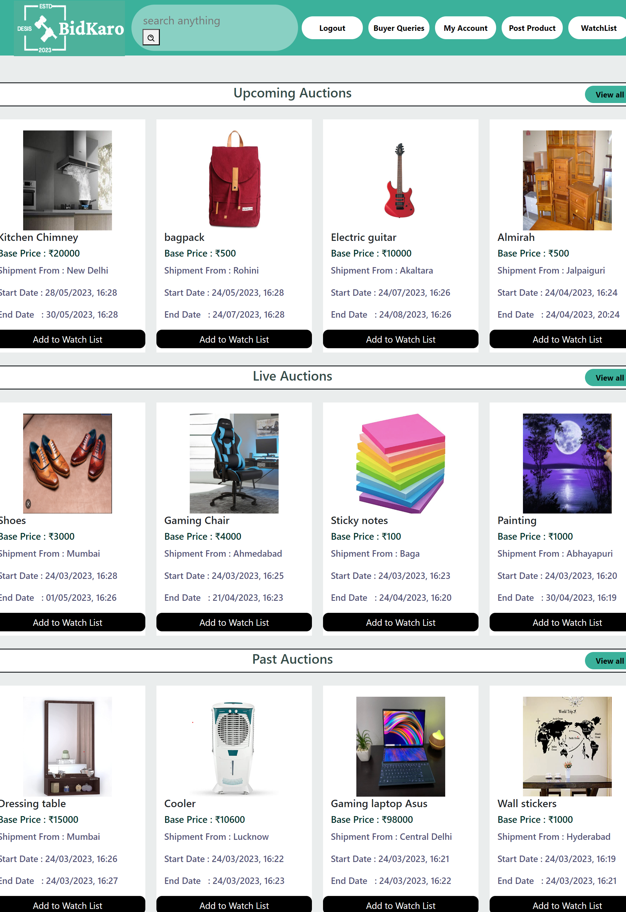

### 🔐 Login and Signup Page
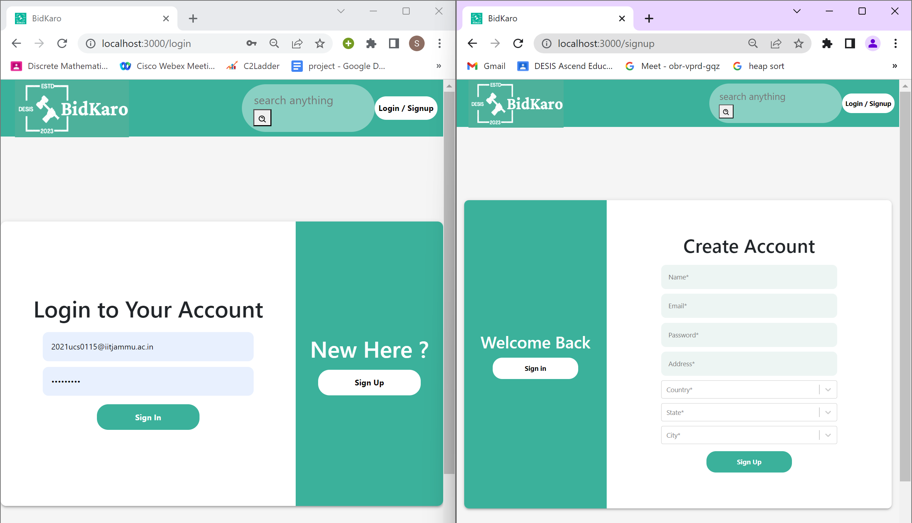

### 📅 Calendar View for a Specific date
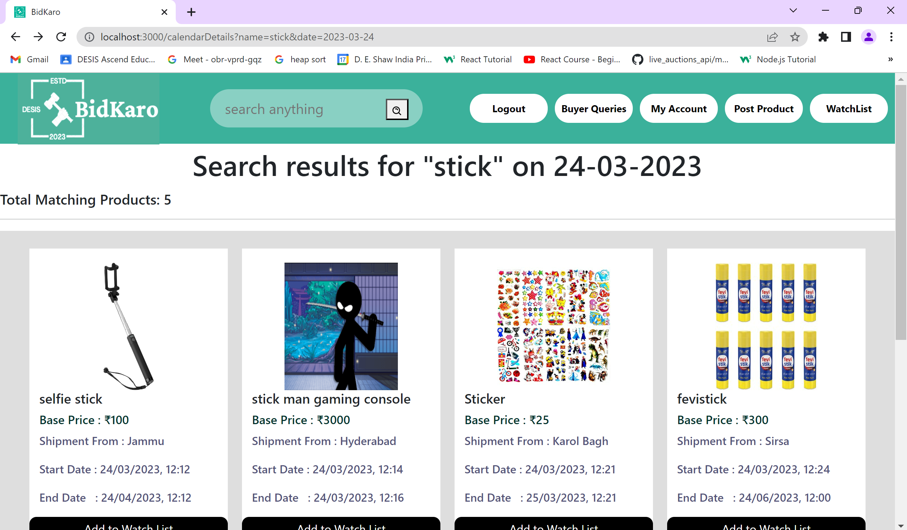

### 📅 Calendar View for Search Results
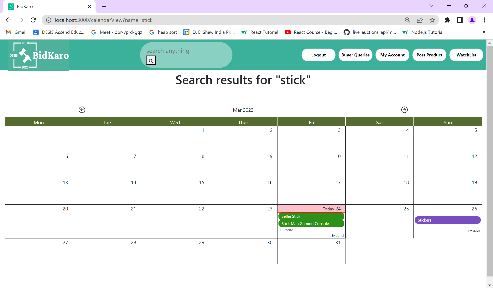

### 🛍️ Product Details


### 📊 Auction Space for a Product
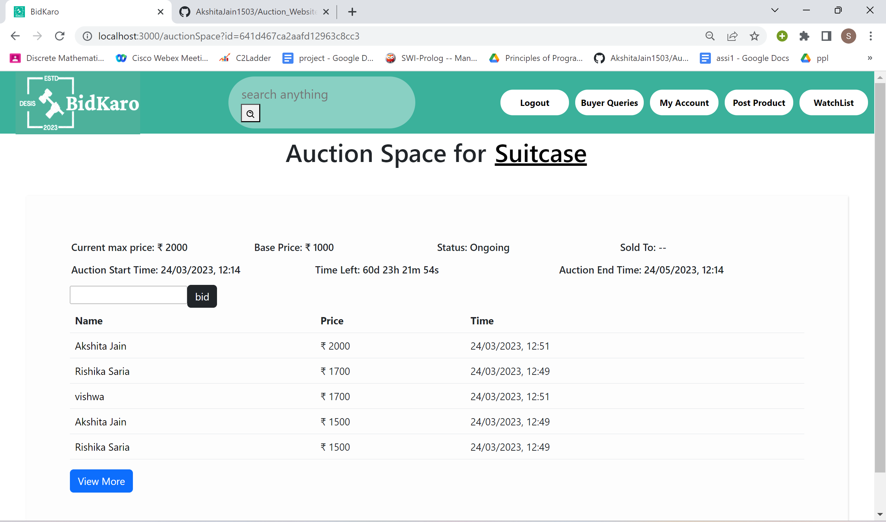

### 📦 Search Results
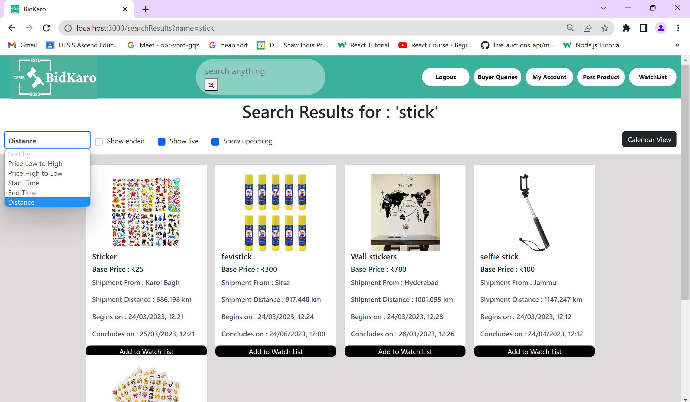

### ⭐ Watchlist
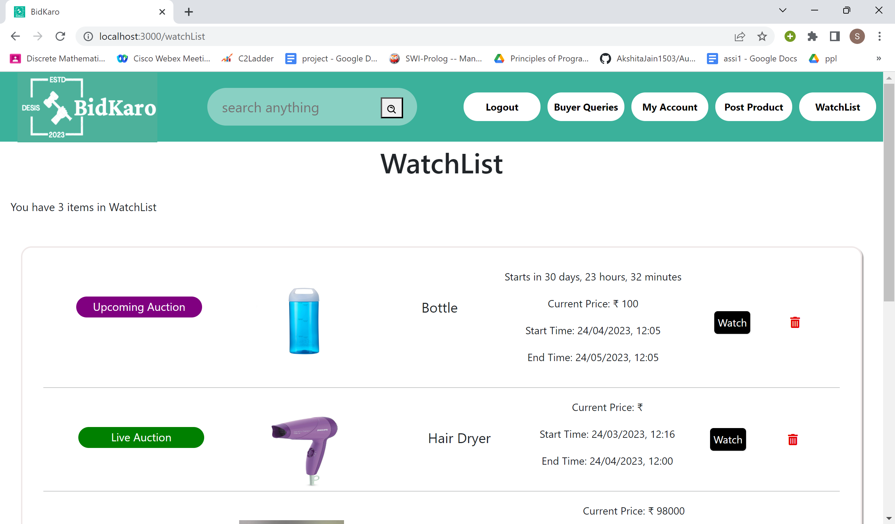

### 🛒 Past Purchases
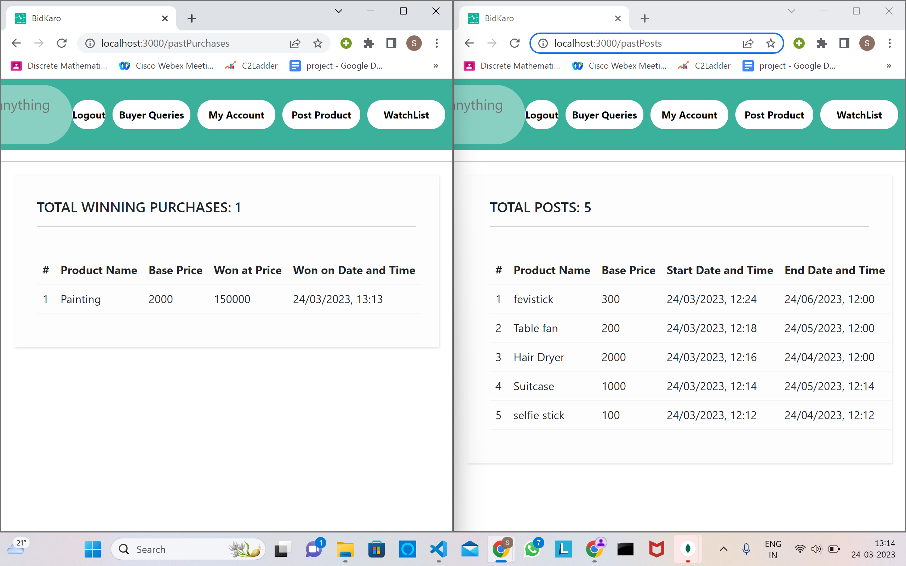

### 📧 Email Notifications


### 💬 Chat System
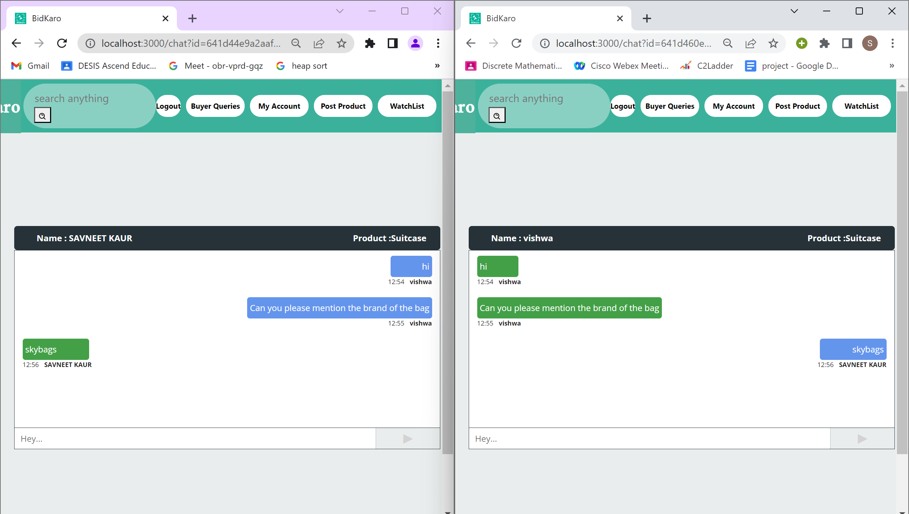

### 🙍‍♂️ My Profile
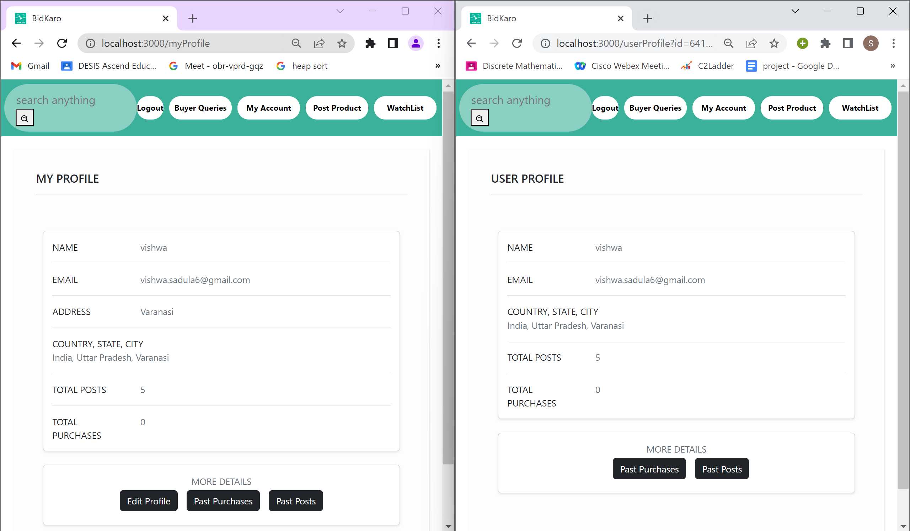

### ✏️ Edit Profile
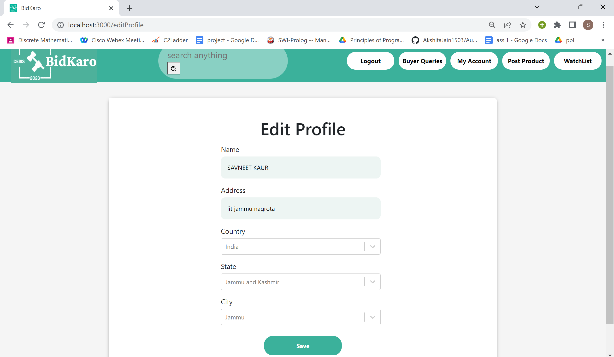

### ❓ Buyer Queries
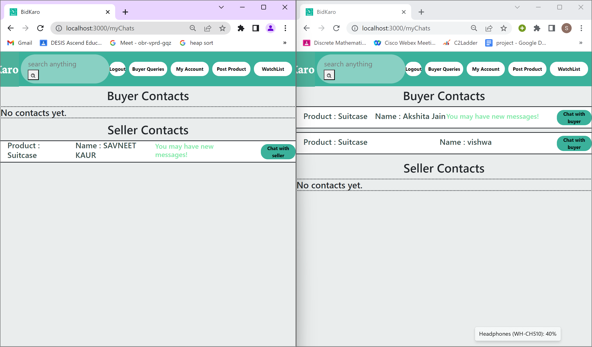

